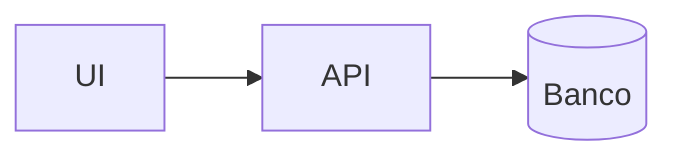

# Arquitetura & Decisões Técnicas (TDD)

## Visão geral

Descreva os componentes e como se comunicam.

## Decisões (ADR resumido)

### ADR-001 — <título>

- **Contexto:** ...
- **Decisão:** ...
- **Consequências:** ...

## Estratégia de testes

Como os testes guiam o design (unidade, contrato, integração).
